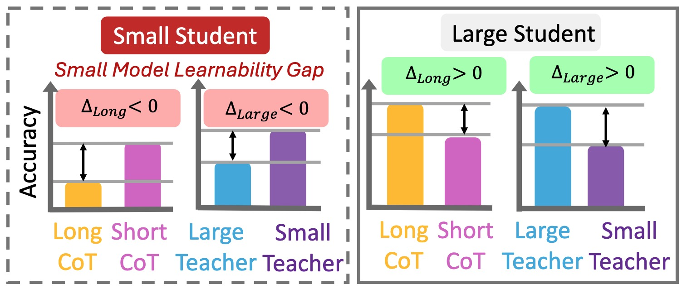

# Small-Model-Learnability-Gap

This is the official repository for "[Small Models Struggle to Learn from Strong Reasoners](https://arxiv.org/pdf/2502.12143)".

[](https://arxiv.org/pdf/2502.12143) [](https://opensource.org/licenses/MIT)

<!-- **🌟 Update**:  -->

## Abstract

Large language models (LLMs) excel in complex reasoning tasks, and distilling their reasoning capabilities into smaller models has shown promise. However, we uncover an interesting phenomenon, which we term the Small Model Learnability Gap: small models (≤3B parameters) do not consistently benefit from long chain-of-thought (CoT) reasoning or distillation from larger models. Instead, they perform better when fine-tuned on shorter, simpler reasoning chains that better align with their intrinsic learning capacity. To address this, we propose Mix Distillation, a simple yet effective strategy that balances reasoning complexity by combining long and short CoT examples or reasoning from both larger and smaller models. Our experiments demonstrate that Mix Distillation significantly improves small model reasoning performance compared to training on either data alone. These findings highlight the limitations of direct strong model distillation and underscore the importance of adapting reasoning complexity for effective reasoning capability transfer.

## Overview



## Getting Start

**Get Code**
```
git clone https://github.com/Small-Model-Gap/Small-Model-Learnability-Gap
```
**Build Environment**
```
cd Small-Model-Learnability-Gap/lm-evaluation-harness
conda create -n Small-Model-Gap python=3.10
conda activate Small-Model-Gap
pip install . -e
pip install vllm==0.6.3
```

---

## Evaluation

- For models with up to 7B parameters, modify the configuration in `lm-evaluation-harness/test.sh`. 
- For models larger than 14B, adjust the parameters in `lm-evaluation-harness/test_lora.sh`.

**Available tasks:**

- AIME  
- AMC  
- Olympiad  
- gsm8k_cot_zeroshot  
- hendrycks_math  
- hendrycks_math_500

*Note:* For models above 32B, using long CoT on the `hendrycks_math` task (5000 samples) might take significantly long time.

**Model Selection:**  
We have open-sourced models for Short CoT, Long CoT, Mix-long, and Mix-large on Hugging Face. You can directly use these models to evaluate their performance. Additionally, we provide datasets for long CoT, short CoT, distilled large teacher models, distilled small teacher models, as well as Mix-Long and Mix-Large, so you can fine-tune your model of choice.

Hugging Face link: [https://huggingface.co/UWNSL](https://huggingface.co/UWNSL)

**GPU Setting:**  
Adjust 'tensor_parallel_size' and 'data_parallel_size' in the script to fit your GPU setting.

**Judging:**  
We found that rule-based matching has many edge cases and failure instances. Therefore, our scoring includes two steps:
1. Initial rule-based matching.
2. For any incorrect result from this matching, use `Qwen2.5-32B-Instruct` to directly compare the model generated answer in the "boxed{}" with the ground truthfinal answer. `Qwen2.5-7B-Instruct` as a judge may still have bad cases sometimes.

Execute the following command to score the results:

```
python math_metric_llm_eval_general.py --directory_path lm-evaluation-harness/${output_path}/${SANTIZED_MODEL_SAVE_LABEL} --task ${task}
```

Final scores are saved in the file named `summary_results_{task}`. Additionally, you can review the file `problematic_instances_{task}.json` to find cases where the rule-based judge failed but the LLM judge was correct.

**Example Evaluation Script:**

```bash
models=("UWNSL/Qwen2.5-3B-Instruct_Short_CoT" "UWNSL/Qwen2.5-3B-Instruct_Long_CoT")
tasks=("AIME" "AMC" "Olympiad" "gsm8k_cot_zeroshot" "hendrycks_math")

max_model_tokens=16000
max_gen_tokens=16000
model_args="tensor_parallel_size=1,data_parallel_size=4,gpu_memory_utilization=0.8,max_model_len=$max_model_tokens,dtype=bfloat16"
output_path="long_cot_vs_short_cot"
batch_size="auto"

for task in "${tasks[@]}"; do
    for model in "${models[@]}"; do
        echo "Running lm_eval with model: $model, task: $task"
        lm_eval --model vllm \
            --model_args pretrained="$model",$model_args \
            --gen_kwargs do_sample=false,temperature=0,max_gen_toks=$max_gen_tokens \
            --tasks "$task" \
            --batch_size "$batch_size" \
            --log_samples \
            --trust_remote_code \
            --output_path "$output_path" \
            --apply_chat_template
       
        SANTIZED_MODEL_SAVE_LABEL=$(echo ${model} | sed 's/\//__/g')
        echo ${SANTIZED_MODEL_SAVE_LABEL}
        python math_metric_llm_eval_general.py --directory_path lm-evaluation-harness/${output_path}/${SANTIZED_MODEL_SAVE_LABEL} --task ${task}

    done
done
```

---

## [Optional] Customize New Tasks

For details on adding new tasks, please refer to the [lm-evaluation-harness documentation](https://github.com/EleutherAI/lm-evaluation-harness/blob/main/docs/new_task_guide.md) and add additional task configurations in the `lm-evaluation-harness/lm_eval/tasks/` directory.

---

## Acknowledgements

This repository is built upon [lm-evaluation-harness](https://github.com/EleutherAI/lm-evaluation-harness). We would like to thank all contributors for their support.

---

## Citation
```
@article{li2025small,
  title={Small Models Struggle to Learn from Strong Reasoners},
  author={Li, Yuetai and Yue, Xiang and Xu, Zhangchen and Jiang, Fengqing and Niu, Luyao and Lin, Bill Yuchen and Ramasubramanian, Bhaskar and Poovendran, Radha},
  journal={arXiv preprint arXiv:2502.12143},
  year={2025}
}
```